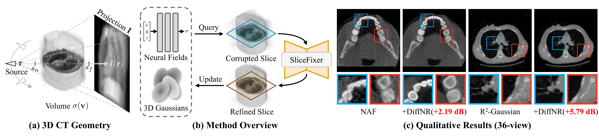

<div align="center">

# DiffNR: Diffusion-Enhanced Neural Representation

### Diffusion-Enhanced Neural Representation Optimization for Sparse-View 3D Tomographic Reconstruction

[](https://ojs.aaai.org/index.php/AAAI/article/view/37871)
[](https://arxiv.org/abs/2604.21518)
[](LICENSE)
[](https://ooonesevennn.github.io/DiffNR/)

</div>

## 🔥 Latest Updates

- **[2026/04]** Code and pretrained SliceFixer weights released (for Gaussian-based DiffNR).
- **[2025/11]** DiffNR was accepted to **AAAI 2026**!

---

## 📌 Overview

**DiffNR** is a novel framework that enhances neural representation optimization with diffusion priors for sparse-view 3D CT reconstruction, improving PSNR by 3.99 dB on average while maintaining efficient optimization.

<div align="center">

</div>

## 💡 Key Highlights

- **SliceFixer**:  a single-step diffusion model that corrects artifacts in NR-reconstructed CT slices, conditioned on biplanar X-ray projections and text prompts.
- **Diffusion-enhanced optimization**: periodically optimizing NRs with pseudo-reference volumes under 3D perceptual SSIM supervision, avoiding frequent diffusion queries and hallucinated details..

---

## 🛠️ Setup

### 1. Clone the Repository

```bash
git clone https://github.com/ooonesevennn/DiffNR
cd DiffNR
```

### 2. Create Conda Environment

```bash
conda create -n diffnr python=3.10 -y
conda activate diffnr
```

### 3. Install Dependencies

```bash
pip install -r requirements.txt
```

### 4. Install CUDA Toolkit

Building the CUDA extensions requires `nvcc`. Install via conda:

```bash
conda install -c nvidia/label/cuda-13.0.0 cuda-toolkit -y
```

### 5. Build CUDA Extensions

```bash
export CUDA_HOME=$CONDA_PREFIX

pip install --no-build-isolation r2_gaussian/submodules/simple-knn
pip install --no-build-isolation -e r2_gaussian/submodules/fused-ssim
pip install --no-build-isolation -e r2_gaussian/submodules/xray-gaussian-rasterization-voxelization
```

### 6. Prepare Model Weights

You need two model resources:

1. **SliceFixer checkpoint** (`.pkl`): pass via `--slicefixer-model-path`
2. **SD-Turbo base model**:
   - Hugging Face auto-download: `stabilityai/sd-turbo` (default)
   - Local path: `--sd-turbo-path /path/to/sd-turbo`
   - Environment variable: `SD_TURBO_PATH=/path/to/sd-turbo`


---

## 🚀 Quick Start

### Single Case Training

```bash
python scripts/run_DiffNR.py train \
  --source data/cases/CASE_001 \
  --output output/<case_folder> \
  --config configs/luna16.yaml \
  --slicefixer-model-path model/slicefixer_luna16_gaussian.pkl \
  --organ-type Chest \
  --gpu 0
```

### Batch Training

```bash
python scripts/run_DiffNR.py batch \
  --source data/cases \
  --output output/all_cases \
  --config configs/luna16.yaml \
  --slicefixer-model-path model/slicefixer_luna16_gaussian.pkl \
  --organ-type Chest \
  --gpu 0
```

---

## ⚙️ Arguments

| Argument | Default | Description |
|------|---------|------|
| `--source` / `-s` | *required* | Path to case folder (train) or directory of cases (batch) |
| `--output` / `-m` | *required* | Output experiment directory |
| `--config` | `configs/luna16.yaml` | Path to YAML config file |
| `--slicefixer-model-path` | *required* | Path to pretrained SliceFixer `.pkl` checkpoint |
| `--sd-turbo-path` | `stabilityai/sd-turbo` | Path or HF model id for SD-Turbo |
| `--organ-type` | `Chest` | CT organ type: `Chest` or `Tooth` |
| `--gpu` | `0` | CUDA device id |

---

## 🗂️ Project Structure

```
DiffNR/
├── train_DiffNR.py                # Main training script
├── run_train_DiffNR.sh            # Shell script to launch training
├── configs/                       # YAML experiment configs
│   └── luna16.yaml
├── r2_gaussian/                   # Gaussian reconstruction backbone
│   ├── gaussian/                  # Gaussian model and rendering
│   ├── dataset/                   # Data loading
│   ├── utils/                     # Utility functions
│   └── submodules/                # CUDA extensions
│       ├── simple-knn/
│       ├── fused-ssim/
│       └── xray-gaussian-rasterization-voxelization/
├── slicefixer/                    # Diffusion-based slice enhancement
├── scripts/                       # Launcher scripts
│   ├── run_DiffNR.py              # Unified launcher (train / batch)
│   └── train_all_DiffNR.py        # Batch training helper
├── requirements.txt
├── LICENSE
└── README.md
```

---

## ✅ TODO
- [x] Release DiffNR training code and SliceFixer model weights
- [ ] Release data preprocessing pipeline
- [ ] Release SliceFixer training code

---

## 📝 Citation

If this project is helpful to your research, please cite our paper:

```bibtex
@inproceedings{su2026diffnr,
  title={DiffNR: Diffusion-Enhanced Neural Representation Optimization for Sparse-View 3D Tomographic Reconstruction},
  author={Su, Shiyan and Zha, Ruyi and Shi, Danli and Li, Hongdong and Cheng, Xuelian},
  booktitle={Proceedings of the AAAI Conference on Artificial Intelligence},
  volume={40},
  number={11},
  pages={9144--9152},
  year={2026}
}
```

---

## 📄 License

This project is released under the MIT License. See the [LICENSE](LICENSE) file for details.

---

## 💬 Acknowledgments

We thank the contributors of [R2-Gaussian](https://github.com/Ruyi-Zha/r2_gaussian) and [Pix2Pix-Turbo](https://github.com/GaParmar/img2img-turbo) for their open-source codebases.
